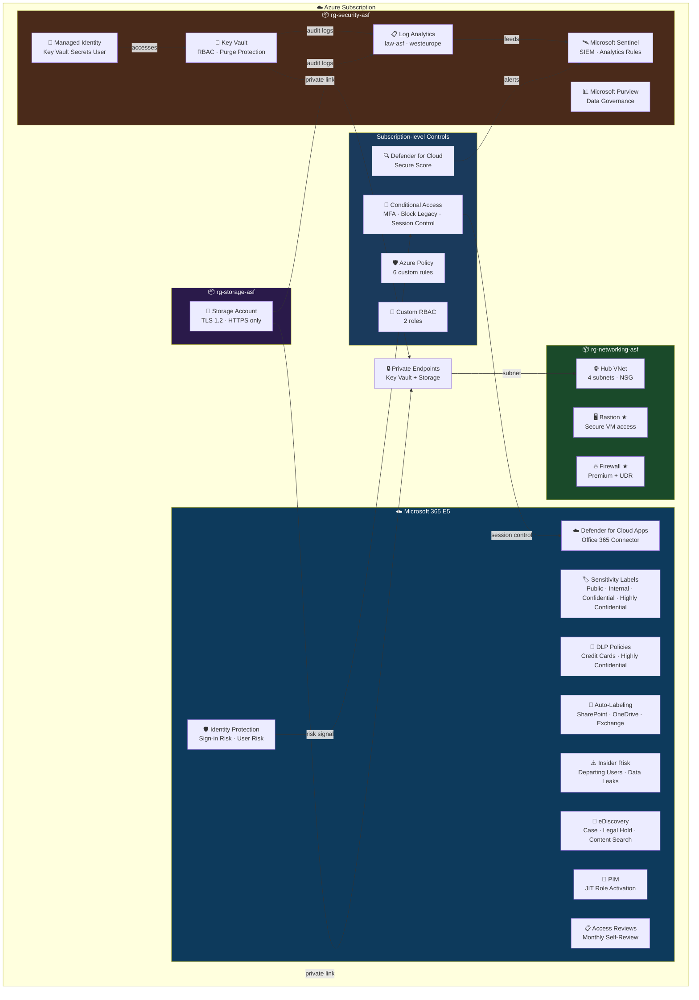

# Azure Secure Foundation

A production-grade Azure security baseline built with Terraform and PowerShell, covering identity, network, data protection, monitoring, and compliance. Designed as a reference architecture for AZ-500 / SC-300 / SC-401 security engineering.

## Architecture



> ★ Bastion and Firewall are deployed on-demand for demos and destroyed after use to minimize cost.

---

## Terraform Modules

| Module | Description |
|--------|-------------|
| `governance` | 3 Resource Groups with CanNotDelete locks |
| `policy` | 6 custom Azure Policy definitions: deny public IPs, deny HTTP, require tags, deny old TLS, deny unencrypted storage, audit MFA |
| `networking` | Hub VNet, 4 subnets (mgmt, bastion, firewall, workload), NSG |
| `key-vault` | Key Vault with RBAC auth, purge protection, private endpoint, diagnostic logging |
| `storage-secure` | Storage account enforcing HTTPS, TLS 1.2, private endpoint, diagnostic logging |
| `rbac` | 2 custom roles: Security Auditor (read-only) and Key Vault Operator |
| `managed-identity` | User-assigned managed identity with Key Vault Secrets User role |
| `private-endpoint` | Private endpoints for Key Vault and Storage — eliminates public network exposure |
| `conditional-access` | CA001: Require MFA · CA002: Block legacy auth · CA003: Session control for unmanaged devices |
| `purview` | Microsoft Purview account for data governance and classification |
| `monitoring` | Log Analytics workspace (westeurope) + diagnostic settings for Key Vault and Storage |
| `sentinel` | Microsoft Sentinel SIEM + 2 scheduled analytics rules (Key Vault access, Failed sign-ins) |
| `bastion` | Azure Bastion + jump VM — deploy for demo, destroy after |
| `firewall` | Azure Firewall Premium + policy + UDR — deploy for demo, destroy after |

---

## Security Controls

### Identity & Access
- MFA enforced via Conditional Access for all users (CA001)
- Legacy authentication protocols blocked (CA002)
- **PIM (Privileged Identity Management)** — Key Vault Administrator role configured as eligible (JIT activation only)
- **Access Reviews** — monthly self-review with auto-remove if no response
- User-assigned Managed Identity for service-to-service auth (no secrets)
- Custom RBAC roles following least-privilege principle

### Threat Detection & Identity Protection
- **Entra ID Protection** — two risk-based Conditional Access policies:
  - `ASF-SignIn-Risk-Policy` — Medium+ sign-in risk → require MFA
  - `ASF-User-Risk-Policy` — High user risk → force password change
- Risk signals from Identity Protection feed directly into Conditional Access

### Network Security
- All resources on private endpoints — no public network exposure
- Azure Firewall Premium with application and network rules
- NSG with explicit allow/deny rules
- Azure Bastion for secure VM access (no public RDP/SSH)

### Data Protection & Compliance
- **Sensitivity Labels:** Public, Internal, Confidential, Highly Confidential
- **Custom SIT:** ASF - Israel ID Number (9-digit regex with keyword matching)
- **DLP Policies:**
  - Block sharing of Credit Card numbers (SharePoint, OneDrive, Exchange)
  - Block external sharing of files with Israel ID SIT
- **Auto-Labeling:** automatic label application when SIT patterns detected
- **eDiscovery:** case `ASF-Investigation-2026` with legal hold and content search
- **Insider Risk Management:**
  - `ASF-DataTheft-DepartingUsers` — DepartingEmployeeSPV scenario
  - `ASF-DataLeaks-General` — LeakOfInformation scenario
- Key Vault with purge protection and soft delete (90 days)
- Storage enforcing TLS 1.2 and HTTPS-only
- Microsoft Purview for data governance

### Monitoring & Threat Detection
- Log Analytics workspace (westeurope — required for Defender XDR unified portal)
- **Microsoft Sentinel** connected to Defender XDR portal with 2 analytics rules:
  - `ASF-KeyVault-Suspicious-Access` — detects unauthorized Key Vault access (Medium, CredentialAccess)
  - `ASF-Failed-SignIns` — detects brute force attempts (High, CredentialAccess)
- Microsoft Defender for Cloud with Secure Score monitoring
- Data Connectors: Azure Activity, Defender for Cloud, Microsoft Entra ID

### Defender for Cloud Apps
- Office 365 App Connector configured
- Conditional Access App Control policy (`ASF-SessionControl-UnmanagedDevices`) routes unmanaged device sessions through Defender for Cloud Apps

**Zero Trust session control flow:**
```
Unmanaged device
    ↓
User logs into SharePoint / M365
    ↓
Entra CA detects unmanaged device → routes session through Defender for Cloud Apps
    ↓
Session Policy: block download of Highly Confidential files
```

### Governance
- 6 Azure Policy definitions enforced at subscription level
- Resource locks (CanNotDelete) on all resource groups
- Mandatory tagging policy (environment, project, owner)

---

## Prerequisites

- Azure subscription with Owner role
- Microsoft 365 E5 license (for Purview, Sentinel, Identity Protection, PIM, Defender for Cloud Apps)
- Terraform >= 1.8
- Azure CLI (`az login`)
- PowerShell 7+ with ExchangeOnlineManagement module

---

## Deploy

```bash
cd terraform
terraform init
terraform apply
```

### On-demand resources (deploy → demo → destroy)

```bash
terraform apply -target=module.bastion -target=module.firewall -var="vm_admin_password=<password>"
terraform destroy -target=module.bastion -target=module.firewall -var="vm_admin_password=<password>"
```

---

## M365 Compliance Scripts

Run in order from an external PowerShell 7 window (not VS Code embedded terminal — WAM auth requires external browser).

```powershell
Connect-IPPSSession -UserPrincipalName <AdminUPN>
```

| Script | What it does |
|--------|-------------|
| `New-SensitivityLabels.ps1` | Creates 4 sensitivity labels: Public, Internal, Confidential, Highly Confidential |
| `New-CustomSITs.ps1` | Creates custom SIT: ASF - Israel ID Number (9-digit regex + keyword matching) |
| `New-DLPPolicies.ps1` | 2 DLP policies: block credit cards + block Israel ID externally |
| `New-AutoLabelingPolicies.ps1` | 2 auto-labeling policies in TestWithoutNotifications mode |
| `New-EDiscoveryCase.ps1` | eDiscovery case + legal hold + content search |
| `New-InsiderRiskPolicy.ps1` | 2 insider risk policies: DepartingEmployeeSPV + LeakOfInformation |

```powershell
.\New-SensitivityLabels.ps1 -AdminUPN admin@tenant.onmicrosoft.com
.\New-CustomSITs.ps1 -AdminUPN admin@tenant.onmicrosoft.com
.\New-DLPPolicies.ps1 -AdminUPN admin@tenant.onmicrosoft.com
.\New-AutoLabelingPolicies.ps1 -AdminUPN admin@tenant.onmicrosoft.com
.\New-EDiscoveryCase.ps1 -AdminUPN admin@tenant.onmicrosoft.com
.\New-InsiderRiskPolicy.ps1 -AdminUPN admin@tenant.onmicrosoft.com
```

> Note: Auto-Labeling requires Unified Audit Log to be enabled. Allow up to 60 minutes after enabling before running the script.

---

## Variables

| Variable | Description | Default |
|----------|-------------|---------|
| `subscription_id` | Azure Subscription ID | required |
| `tenant_id` | Azure AD Tenant ID | `""` |
| `location` | Primary Azure region | `israelcentral` |
| `monitoring_location` | Region for Log Analytics + Sentinel | `westeurope` |
| `excluded_user_id` | Object ID excluded from Conditional Access | `""` |
| `vm_admin_password` | Password for Bastion jump VM (on-demand only) | `null` |

> `monitoring_location` defaults to `westeurope` because Log Analytics workspace must be in a region supported by the Defender XDR unified portal. `israelcentral` is not supported.

---

## Tech Stack

- **IaC:** Terraform 1.8 · azurerm ~3.110 · azuread ~2.53
- **Cloud:** Microsoft Azure (israelcentral) + Microsoft 365 E5
- **Identity:** Microsoft Entra ID · Conditional Access · PIM · Access Reviews · Identity Protection
- **Security:** Defender for Cloud · Defender for Cloud Apps · Microsoft Sentinel · Azure Key Vault
- **Compliance:** Microsoft Purview · DLP · Sensitivity Labels · eDiscovery · Insider Risk
- **Governance:** Azure Policy · RBAC · Resource Locks
- **Automation:** PowerShell 7 · ExchangeOnlineManagement · Microsoft Graph SDK

---

## Certifications Coverage

| Domain | Controls Demonstrated |
|--------|----------------------|
| **AZ-500** | Key Vault, NSG, Firewall, Bastion, Defender for Cloud, Sentinel, Managed Identity, RBAC |
| **SC-300** | Conditional Access, PIM, Access Reviews, Identity Protection, Defender for Cloud Apps |
| **SC-401** | Sensitivity Labels, DLP, Auto-Labeling, eDiscovery, Insider Risk, Custom SITs |
