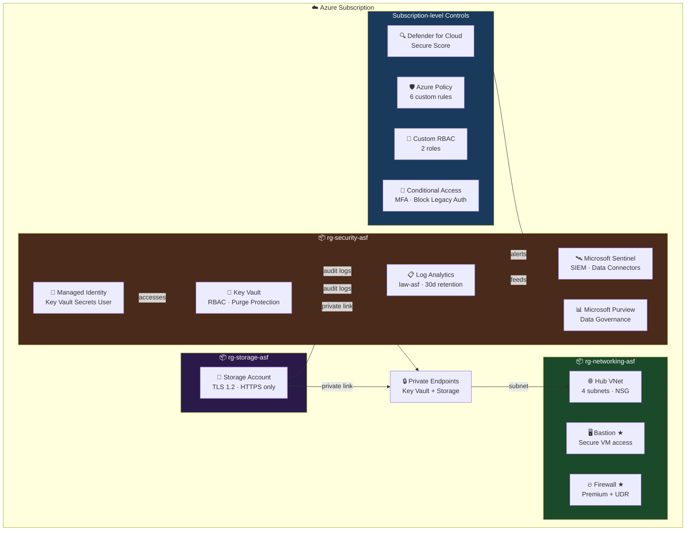

# Azure Secure Foundation

A production-grade Azure security baseline built with Terraform and PowerShell, covering identity, network, data protection, monitoring, and compliance. Designed as a reference architecture for AZ-500 / SC-300 / SC-401 security engineering.

## Architecture



> ★ Bastion and Firewall are deployed on-demand for demos and destroyed after use to minimize cost.

## Modules

| Module | Description |
|--------|-------------|
| `governance` | 3 Resource Groups with CanNotDelete locks |
| `policy` | 6 custom Azure Policy definitions: deny public IPs, deny HTTP, require tags, deny old TLS, deny unencrypted storage, audit MFA |
| `networking` | Hub VNet, 4 subnets (mgmt, bastion, firewall, workload), NSG |
| `key-vault` | Key Vault with RBAC auth, purge protection, private endpoint, diagnostic logging |
| `storage-secure` | Storage account enforcing HTTPS, TLS 1.2, private endpoint, diagnostic logging |
| `rbac` | 2 custom roles: Security Auditor (read-only) and Key Vault Operator |
| `managed-identity` | User-assigned managed identity with Key Vault Secrets User role |
| `private-endpoint` | Private endpoints for Key Vault and Storage — eliminates public network exposure |
| `conditional-access` | CA001: Require MFA for all users · CA002: Block legacy authentication |
| `purview` | Microsoft Purview account for data governance and classification |
| `monitoring` | Log Analytics workspace + diagnostic settings for Key Vault and Storage |
| `sentinel` | Microsoft Sentinel SIEM onboarded to Log Analytics workspace |
| `bastion` | Azure Bastion + jump VM — deploy for demo, destroy after |
| `firewall` | Azure Firewall Premium + policy + UDR — deploy for demo, destroy after |

## Security Controls

**Identity & Access**
- MFA enforced via Conditional Access for all users
- Legacy authentication protocols blocked
- User-assigned Managed Identity for service-to-service auth (no secrets)
- Custom RBAC roles following least-privilege principle

**Network Security**
- All resources on private endpoints — no public network exposure
- Azure Firewall with application and network rules
- NSG with explicit allow/deny rules
- Azure Bastion for secure VM access (no public RDP/SSH)

**Data Protection**
- Key Vault with purge protection and soft delete (90 days)
- Storage enforcing TLS 1.2 and HTTPS-only
- Microsoft Purview for data classification and governance

**Monitoring & Threat Detection**
- Log Analytics workspace collecting audit logs from all resources
- Microsoft Sentinel SIEM for threat detection and incident response
- Microsoft Defender for Cloud with Secure Score
- KQL queries for security hunting

**Governance**
- 6 Azure Policy definitions enforced at subscription level
- Resource locks (CanNotDelete) on all resource groups
- Mandatory tagging policy (environment, project, owner)

## Prerequisites

- Azure subscription with Owner role
- Terraform >= 1.8
- Azure CLI (`az login`)
- PowerShell 7+ with ExchangeOnlineManagement and Microsoft.Graph modules (for M365 scripts)

## Deploy

```bash
cd terraform
terraform init
terraform apply
```

### On-demand resources (deploy → demo → destroy)

```bash
# Bastion + Firewall
terraform apply -target=module.bastion -target=module.firewall -var="vm_admin_password=<password>"
terraform destroy -target=module.bastion -target=module.firewall -var="vm_admin_password=<password>"
```

## M365 Compliance Scripts

PowerShell scripts for Microsoft Purview compliance configuration. Requires Microsoft 365 E5.

| Script | Description |
|--------|-------------|
| `New-SensitivityLabels.ps1` | Creates sensitivity labels: Public, Internal, Confidential, Highly Confidential |
| `New-DLPPolicies.ps1` | Data Loss Prevention policies for credit cards, SSN, passports |
| `New-CustomSITs.ps1` | Custom Sensitive Information Types |
| `New-AutoLabelingPolicies.ps1` | Auto-labeling policies for SharePoint and Exchange |
| `New-EDiscoveryCase.ps1` | eDiscovery case with custodians and hold policies |
| `New-InsiderRiskPolicy.ps1` | Insider Risk Management policy for data theft detection |

```powershell
cd scripts/powershell
Connect-ExchangeOnline
Connect-MgGraph -Scopes "InformationProtectionPolicy.ReadWrite.All"
.\New-SensitivityLabels.ps1
```

## Variables

| Variable | Description |
|----------|-------------|
| `subscription_id` | Azure Subscription ID |
| `tenant_id` | Azure AD Tenant ID |
| `location` | Primary Azure region (e.g. `israelcentral`) |
| `excluded_user_id` | Object ID of user excluded from Conditional Access |
| `vm_admin_password` | Password for Bastion jump VM (on-demand only) |

## Tech Stack

- **IaC:** Terraform 1.8 · azurerm ~3.110 · azuread ~2.53
- **Cloud:** Microsoft Azure (israelcentral)
- **Identity:** Microsoft Entra ID · Conditional Access · Managed Identity
- **Security:** Microsoft Defender for Cloud · Microsoft Sentinel · Azure Key Vault
- **Compliance:** Microsoft Purview · Azure Policy · RBAC
- **Automation:** PowerShell 7 · Microsoft Graph SDK · ExchangeOnlineManagement
